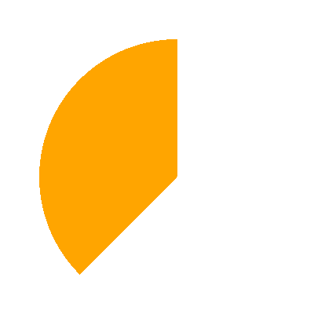

## Pacman
- This week all problems will revolve around a single situation: simulating a very small portion of the classic arcade game Pacman
- Tasks will thus include:
  - Creating and adding a Pacman shape to the window
  - Getting Pacman to move
  - Implementing bouncing off the walls
  - Getting Pacman to "eat" the pills as he moves
  - (Optional) Getting Pacman's mouth to gobble as he moves
- The solutions to these tasks will also prove _highly useful_ when working through the Breakout Project!

# Part A: Creating Pacman

## Creating the Shape
- The template file automatically creates the scene below when run
- Your initial task is to add the classic yellow Pacman shape to the center of the screen
  - Consists of a circle missing a 90 deg segment centered on the positive x-axis
- Recall when working with `GArc`s how you need to specify the location! That will be important for getting Pacman properly centered

:::r-stack


{.fragment}

:::

## Something to smile about

::::::cols
::::{.col style='font-size:.9em'}
<!--- Up until now, we haven't had a way to draw an arc!-->
- The `GArc` class represents an arc formed by taking a section of the perimeter of an oval.
- 3 things necessary:
	- The bounding rectangle geometry (upper left corner and width and height)
	- The _starting angle_ (in degrees)
	- The _sweep angle_ (in degrees) which is how far the arc extends
- Negative angles move in the clockwise direction
::::

::::col

\begin{tikzpicture}%%width=100%
\draw[MPurple] (-2,0) -- (2,0) (0,-2) -- (0,2);
\draw[dashed, MBlue] (-1.5,-1.5) rectangle (1.5, 1.5);
\draw[ultra thick, MRed, line cap=round] (45:1.5) arc (45:270:1.5);

\draw[MOrange, dashed] (0,0) -- (45:1.5);
\draw[MOrange, thick, -stealth] (0:1) arc (0:45:1) node[midway,right,font=\scriptsize\sf] {start};

\draw[MGreen, thick, -stealth] (45:0.5) arc (45:270:0.5) node[midway, left, font=\scriptsize\sf] {sweep};
\end{tikzpicture}

::::
::::::


## Fillable Arcs
- The `GArc` class is a `GFillableObject`, and so you can call `.set_filled()` on a `GArc` object
- Filled like a pie-shaped wedge formed between the center of the bounding box and the starting and end points of the arc

::::::cols
::::col
```python
def filled_arc():
    gw = GWindow(400, 400)
    arc = GArc(50, 50, 
			   350, 350, 
			   90, 135)
    arc.set_color("orange")
    arc.set_filled(True)
    gw.add(arc)
```
::::

::::col
{width=50%}
::::
::::::

## Part A: Pacman Created
```{.mypython style='max-height:900px'}
def create_pacman():
    pacman = GArc(
        GW_WIDTH / 2 - PACMAN_RADIUS,  #centered x
        GW_HEIGHT / 2 - PACMAN_RADIUS, #centered y
        2 * PACMAN_RADIUS,             #width
        2 * PACMAN_RADIUS,             #height
        45,                            #starting angle
        270,                           #sweep angle
    )
    pacman.set_filled(True)
    pacman.set_fill_color("yellow")
    return pacman

pacman = create_pacman()
gw.add(pacman)
```

# Part B: Moving Pacman
## Moving in a single direction {data-state="MovePacmanTrace"}
- The next task is to get Pacman moving!
- Create a `step` callback function and define an interval event listener to call that function every 20 ms
- Each time the `step` function is called, it should move Pacman forward (to the right) by the number of pixels indicated by the provided constant

<div id="PacmanMoveCanvas" class="CTCanvas" 
  style="border: none; background-color:black; width:900px; height:400px; margin:auto;"></div>


## Part B: Pacman Moved
```{.mypython style='max-height:800px'}
def step():
    pacman.move(PACMAN_SPEED, 0)

gw.set_interval(step, 20)
```


# Part C: Bouncing Pacman
## Flipping at the edges
:::{style='font-size:.9em'}
- Currently, Pacman will just move off the right side of the screen, which is not ideal. Instead we want Pacman to reverse direction at the wall
- Will thus need to keep track of Pacman's current direction somehow
  - This will need to be updated or set within the `step` callback function, so it **must** be added as an attribute to the `GWindow` (called `gw` here)
- Update the movement in your `step` function to use this new variable
- Add a conditional check to see if an edge of Pacman has extended beyond an edge of the screen, and reverse the direction if so
- You can also use the `set_starting_angle` and `get_starting_angle` methods for `GArc`s to flip Pacman around to face the other direction!
:::

## Bouncing Visualized {data-state="BouncePacmanTrace"}
<div id="PacmanBounceCanvas" class="CTCanvas" 
  style="border: none; background-color:black; width:900px; height:400px; margin:auto;"></div>

## Pseudo Bouncing
- In pseudocode, you might have something like:
```mypython
def step():
    pacman.move(|||something involving the direction|||, 0)

    if |||left or right edge of Pacman extends off screen|||:
        |||reverse Pacman direction by switching direction variable value|||
        |||turn Pacman around by changing starting angle of arc|||

|||initialize direction variable|||
gw.set_interval(step, 20)
```

## Pacman Bounced
```{.mypython style='max-height: 800px; font-size:.8em'}
def step():
    pacman.move(gw.dx, 0)
    if (pacman.get_x() + 2 * PACMAN_RADIUS > GW_WIDTH #right edge
        or pacman.get_x() < 0 #left edge
       ):
        gw.dx *= -1 #flip it
        pacman.set_start_angle((pacman.get_start_angle() + 180) % 360)

pacman = create_pacman()
gw.dx = PACMAN_SPEED
gw.set_interval(step, 20)
```


# Part D: Hungry Pacman

## Finding the Pills
- At the moment Pacman just moves over the yellow pills: we'd like to change that so that they actually disappear as Pacman moves over them
- You can remove anything from the `GWindow` with `gw.remove(obj)`, but that requires you to have a variable `obj` that was assigned your particular `GObject`.
  - Here we have named variables for Pacman (`pacman`) and for the background colored rectangle (`bg`), but not the pills!
- So a method is needed to retrieve a `GObject` that has already been added to the window
  - The most obvious of these is the `.get_element_at(x,y)` method for GWindows.


## Getting Elements
- You provide `.get_element_at(x,y)` a pair of coordinates, $x$ and $y$
  - If there is a `GObject` at that location, it will return it to you! So save that object in a variable!
  - If there is no object at that location, it will return `None`
- You can then use any returned object exactly as you would had you assigned it to a variable initially, including removing it from the window!
```mypython
>>> leftmost_pill = gw.get_element_at(20, 200)
>>> print(leftmost_pill)
GOval(20, 190.0, 20, 20)
```

## Pacman's Mouth
::::::cols
::::{.col style='font-size:.85em; flex-grow:1.25'}
- Here we want to remove a pill whenever it gets halfway into Pacman's mouth, as indicated in the image to the right.
- The x and y values of this position will depend on the current position of Pacman, so think about how you could work out where this point is in the window.
- Keep in mind that the object (if any) returned by `.get_element_at` is just the topmost object found at that location. So often times you might want to do a comparison afterwards with an `if` statement to ensure it is the object you are interested in.
::::

::::col


::::
::::::

## Hunger Visualized {data-state="HungerPacmanTrace"}
<div id="PacmanHungerCanvas" class="CTCanvas" 
  style="border: none; background-color:black; width:900px; height:400px; margin:auto;"></div>

## Hunger Satiated
```{.mypython style='max-height:850px;'}
def step():
    ...
    # Adjusting for which side mouth is on
    if gw.dx > 0:
        x = pacman.get_x() + PACMAN_RADIUS * 1.5
    else:
        x = pacman.get_x() + PACMAN_RADIUS * 0.5
    y = pacman.get_y() + PACMAN_RADIUS
    # Getting anything there
    obj = gw.get_element_at(x,y)
    # Removing that thing if present and if it isn't the bg
    if obj is not None and obj is not bg:
        gw.remove(obj)
    ...
```

# Bonus!
## <i class='fa-solid fa-trophy fa-beat'></i> Challenge! {data-state="RavenousPacmanTrace"}
- Currently, Pacman's mouth doesn't move
- Add code to cause Pacman's mouth to repeatedly open and close by adjusting the starting angle and sweep angle every step
- You'll need to adjust both angles in tandem to achieve a symmetric opening and closing of the mouth

<div id="PacmanRavenousCanvas" class="CTCanvas" 
    style="border: none; background-color:black; width:900px; height:400px; margin:auto;"></div>

## Gobbling Glory
```{.mypython style='max-height:850px'}
MOUTH_SPEED = 5

def step():
    ...

    # Gobble
    pacman.set_start_angle(
        pacman.get_start_angle() + gw.mouth
    )
    pacman.set_sweep_angle(
        pacman.get_sweep_angle() - 2 * gw.mouth
    )
    if gw.vel > 0: #right
        if (pacman.get_start_angle() < MOUTH_SPEED or
            pacman.get_start_angle() > 45):
            gw.mouth *= -1
    else: #left
        if (pacman.get_start_angle() < 180 + MOUTH_SPEED or
            pacman.get_start_angle() > (180+45)):
            gw.mouth *= -1

    ...

gw.mouth = -MOUTH_SPEED

```
